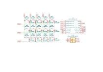
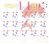
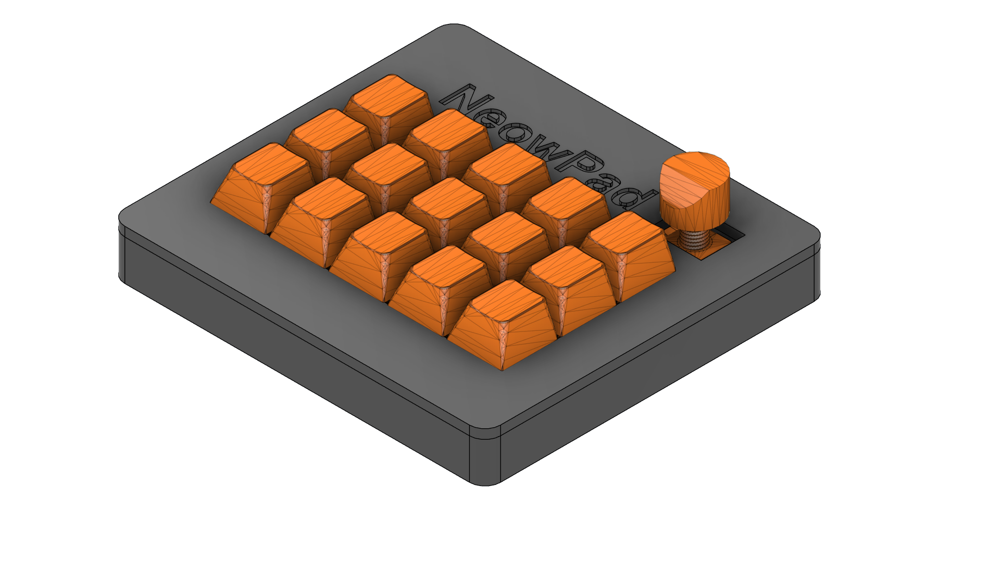

  
# NeowPad
Macropad designed for productivity with customizable encoder and keys

## Description
A medium-sized 15-key macropad with a rotatory encoder. The encoder and every key can be customized as wished on the firmware powered by a XIAO RP2040

## Features
- Every key can be customized as well as the encoder
- Main functions are single-input, multiple-input and macros.
  
**Future plans:**
- Not a single layout but multiple for different task (work, games, ...)
- Key-pressed combinations for more functionality

## BOM
- 1x Case (Top & Bottom)
- 1x Unsoldered Seeed XIAO RP2040
- 15x MX-Style switches
- 15x White blank DSA keycaps
- 15x Through-hole 1N4148 Diodes
- 1x EC11 Rotary encoders
- 4x M3x16mm screws
- 4x M3x5mx4mm heatset inserts

## Design
| **Schematic** |
| :---: |
|  |
| **PCB** |
|  |
| **CAD** |
|  |

## File descriptions

- **CAD**: Contains .stp/.step files and .f3b files.
- **Firmware**: Contains KMK python file.
- **PCB**: Contains gerber.zip (for production), PCB schematic and layout.
- **Production**: All files necessary for the production of the macropad.

## Comments
It has been a lovely journey learning how to design a PCB in KiCAD, the case in CAD programs and learning how to code a firmware for a macropad.   Thanks for the opportunity and eager to learn more about hardware, software and more!

  

